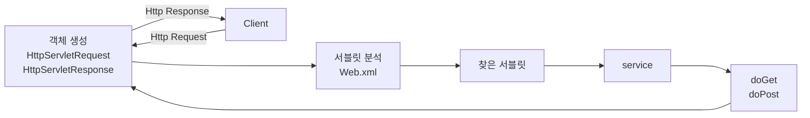

> 클라이언트의 요청을 처리하고, 그 결과를 반환하는 Servlet 클래스의 구현 규칙을 지킨 자바 웹 프로그래밍 기술

* 자바를 사용하여 웹을 만들기 위해 필요한 기술
* 클라이언트가 어떠한 요청을 하면 그에 대한 결과를 다시 전송해주어야 하는데 이 역할을 하는 자바 프로그램

 

## Servlet 특징
1. 클라이언트 요청에 대해 동적으로 작동하는 웹 애플리케이션 컴포넌트
2. HTML을 사용하여 요청에 응답한다
3. Java Thread를 이용하여 동작한다
4. MVC 패턴에서 Controller로 이용한다
5. HTTP 프로토콜 서비스를 지원하는  javax.servlet.http.HttpServlet 클래스를 상속 받는다
6. UDP 보다 처리 속도가 느리다
7. HTML 변경 시 Servlet을 재컴파일해야 하는 단점이 있다

* 동적 페이지를 제공하기 위해서는 다른 곳에 도움을 요청하여 작성해야 한다
  * 동적 페이지 : 사용자가 요청한 시점에 페이지를 생성해서 전달해주는 것을 의미한다
* 여기서 서블릿이 웹 서버가 동적인 페이지를 제공할 수 있게 도와준다
* 동적인 페이지를 생성하는 애플리케이션이 CGI이다

 

## Servlet 동작 방식

1. 사용자가 URL을 입력하면 Http Request가 Servlet Conatiner로 전송한다
2. 요청을 전송 받은 Servlet Container는 HttpServletRequest, HttpServletResponse 객체를 생성한다
3. web.xml을 기반으로 사용자가 요청한 URL이 어느 서블릿에 대한 요청인지 찾는다
4. 해당 서블릿에서 service 메소드를 호출한 후 클라이언트의 GET, POST 여부에 따라 doGet()또는 doPost()를 호출한다
5. doGet() 또는 doPost() 메소드는 동적 페이지를 생성한 후 HttpServletResponse 객체에 응답을 보낸다
6. 응답이 끝나면 HttpServletRequest, HttpServletResponse 두 객체를 소멸시킨다

