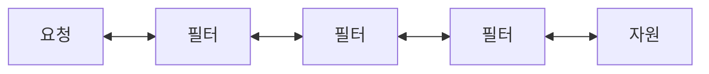

```java
public interface Filter {

  /**
   * Called by the web container to indicate to a filter that it is being
   * placed into service. The servlet container calls the init method exactly
   * once after instantiating the filter. The init method must complete
   * successfully before the filter is asked to do any filtering work.
   * <p>
   * The web container cannot place the filter into service if the init method
   * either:
   * <ul>
   * <li>Throws a ServletException</li>
   * <li>Does not return within a time period defined by the web
   *     container</li>
   * </ul>
   * The default implementation is a NO-OP.
   *
   * @param filterConfig The configuration information associated with the
   *                     filter instance being initialised
   *
   * @throws ServletException if the initialisation fails
   */
  public default void init(FilterConfig filterConfig) throws ServletException {
  }

  /**
   * The <code>doFilter</code> method of the Filter is called by the container
   * each time a request/response pair is passed through the chain due to a
   * client request for a resource at the end of the chain. The FilterChain
   * passed in to this method allows the Filter to pass on the request and
   * response to the next entity in the chain.
   * <p>
   * A typical implementation of this method would follow the following
   * pattern:- <br>
   * 1. Examine the request<br>
   * 2. Optionally wrap the request object with a custom implementation to
   * filter content or headers for input filtering <br>
   * 3. Optionally wrap the response object with a custom implementation to
   * filter content or headers for output filtering <br>
   * 4. a) <strong>Either</strong> invoke the next entity in the chain using
   * the FilterChain object (<code>chain.doFilter()</code>), <br>
   * 4. b) <strong>or</strong> not pass on the request/response pair to the
   * next entity in the filter chain to block the request processing<br>
   * 5. Directly set headers on the response after invocation of the next
   * entity in the filter chain.
   *
   * @param request  The request to process
   * @param response The response associated with the request
   * @param chain    Provides access to the next filter in the chain for this
   *                 filter to pass the request and response to for further
   *                 processing
   *
   * @throws IOException if an I/O error occurs during this filter's
   *                     processing of the request
   * @throws ServletException if the processing fails for any other reason
   */
  public void doFilter(ServletRequest request, ServletResponse response,
                       FilterChain chain) throws IOException, ServletException;

  /**
   * Called by the web container to indicate to a filter that it is being
   * taken out of service. This method is only called once all threads within
   * the filter's doFilter method have exited or after a timeout period has
   * passed. After the web container calls this method, it will not call the
   * doFilter method again on this instance of the filter. <br>
   * <br>
   *
   * This method gives the filter an opportunity to clean up any resources
   * that are being held (for example, memory, file handles, threads) and make
   * sure that any persistent state is synchronized with the filter's current
   * state in memory.
   *
   * The default implementation is a NO-OP.
   */
  public default void destroy() {
  }
}

```

* 스프링의 독자적인 기능이 아닌 자바 서블릿에서 제공하는 기능이다
* 스프링 프레임워크에서 필터로 인증 등 다양한 작업을 하는데 사용된다

<br>

[스프링 프레임워크에 대한 요청 라이프사이클.img](https://kimkihyun0206.github.io/backend-logos/assets/img/spring/annotation/Filter.png)

위 그림은 스프링 프레임워크에서 요청에 대한 라이프사이클을 나타낸 그림이다.
스프링 프레임워크로 들어온 요청이 DispatcherServlet에 의해 컨트롤러에 매필된다.
필터는 요청이 DispatcherServlet에 의해 다루어지기 전과 후에 동작한다.



또한 Filter는 FilterChain을 통해 여러 필터가 연쇄적으로 동작하게 할 수 있다

### Filter는 어디에 쓰일까

> 필터는 주로 요청에 대한 인증, 권한 체크 등을 하는데에 쓰인다

구체적으로 들어온 요청이 DispatcherServlet에 전달되기 전에 헤더를 검사해 인증 토큰이 있는지 없는지, 올바른지 올바르지 않은지 등을 검사할 수 있다.

<br>

### Filter의 사용법

> 클래스를 만들어서 인터페이스를 구현해서 만들 수 있다

Filter는 메소드 세 가지를 가지고 있다

1. `init()` : 필터가 생성될 때 수행되는 메소드
2. `doFilter()` : Request, Response가 필터를 거칠 때 수행되는 메소드
3. `destroy()` : 필터가 소멸될 때 수행되는 메소드

위 세가지 메소드를 구현하면 필터가 된다

```java
public class SampleFilter implements Filter {
    @Override
    public void init(FilterConfig filterConfig) throws ServletException {
        log.info("SampleFilter Generated");
    }

    @Override
    public void doFilter(ServletRequest servletRequest, ServletResponse servletResponse, FilterChain filterChain) throws IOException, ServletException {
        log.info("SampleFilter Start");
        filterChain.doFilter(servletRequest, servletResponse);
        log.info("SampleFilter Finish");
    }

    @Override
    public void destroy() {
        log.info("SampleFilter destroy.");
    }
}
```

위처럼 만들면 된다.
그리고 Filter가 여러 개 만들어질 수 있다고 했는데 이는 `FilterRegistrationBean`의 `setOrder()` 메소드로 결정할 수 있다

```java
@Configuration
public class FilterConfig {
  @Bean
  public void runSomeFilterRegistration() {
    someFilterRegistration();
  }

  private FilterRegistrationBean<SampleFilter> someFilterRegistration() {
    FilterRegistrationBean<SomeFilter> registration = new FilterRegistrationBean<>();
    registration.setFilter(new SampleFilter());
    registration.addUrlPatterns("/sample/*"); // url 패턴 설정
    registration.addInitParameter("param1", "param_value1"); // 파라미터 설정
    registration.setName("sample-filter"); // 필터명 설정
    registration.setOrder(1); // 순서 설정

    return registration;
  }
}
```
